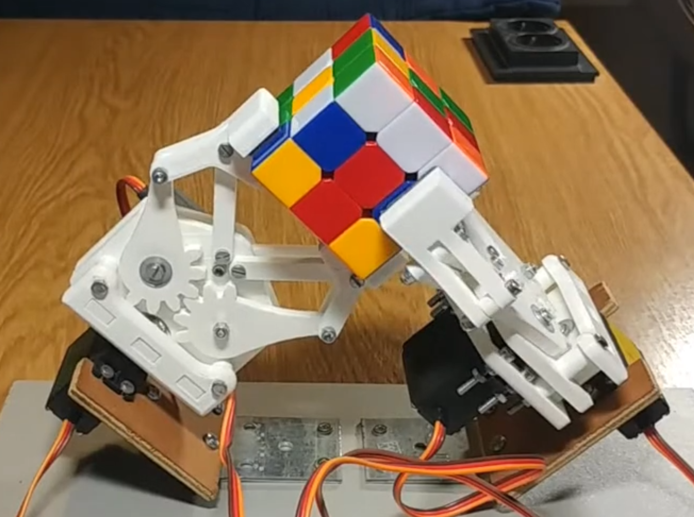
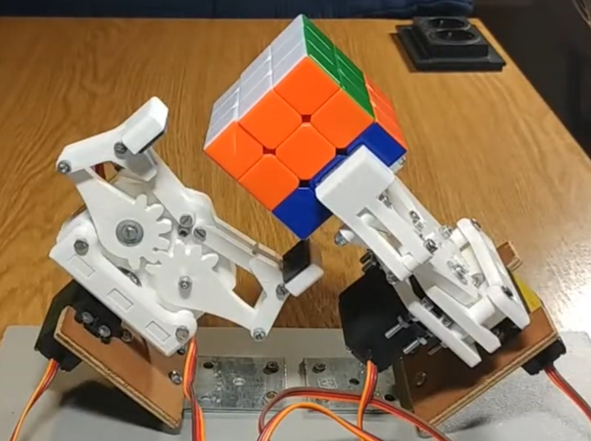
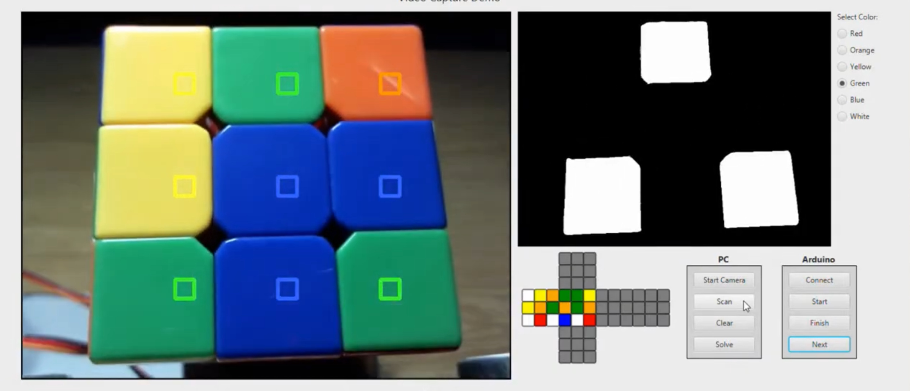

# Cuber

`Cuber` is a Rubik's cube solving robot prototype built from three parts:

- a camera-based scanning UI
- a cube solver and desktop control app
- Arduino firmware for the servo-driven robot

This project was developed as my bachelor's thesis project.

The robot uses 3D-printed grippers to hold and rotate the cube while the software scans faces, computes a solution, and sends a sequence of rotations to execute.

This was a real hardware prototype, not a clean-room robotics framework. Some parts, especially the motion calibration in the firmware, are hardware-specific and were tuned by brute force because physical reality is rude.

## Demo

Video demo:

Direct link: <https://youtu.be/DdL1mxfUf3U>

## Photos

Alternate robot position during manipulation:

Robot prototype:

Scanning and control UI:

## How It Works

1. The cube is scanned face by face using the camera-based interface.
2. The robot rotates the cube in front of the camera so different faces can be captured.
3. Detected colors are converted into a cube state representation.
4. A solver computes the move sequence.
5. The move sequence is sent to the robot controller.
6. The Arduino firmware drives the servos and executes the solution physically.

## Repository Structure

- `android-app/`
  Phone-side application for scanning cube colors, Bluetooth communication, and robot interaction.

- `desktop-app/`
  Desktop Java application containing the cube solver, serial communication, and camera/control UI.

- `arduino-firmware/`
  Arduino sketch files for the physical robot, including basic moves, face rotations, and calibration logic.

## Communication

- `desktop-app` talks to the Arduino controller over serial.
- `android-app` uses Bluetooth RFCOMM for robot interaction.

## Notes On The Code

- This is an older prototype project.
- The firmware contains hard-coded offsets and calibration-heavy logic tied to the physical build.
- The interesting part of the repo is the end-to-end system: scanning, solving, and physically executing the moves on a real robot.
- The codebase should be read as a working project artifact, not as a polished robotics library.
- Some hardware control logic is unapologetically prototype-grade and tuned to this specific robot.

## Tech

- Android app for scanning and control
- Java desktop app
- OpenCV-based camera processing
- Cube solving library / two-phase solver integration
- Arduino firmware for servo control
- 3D-printed grippers and custom hardware linkage

## Why This Repo Exists

This project shows a full-stack-ish robotics build across software, vision, and hardware control:

- computer vision for cube scanning
- solver integration
- serial / Bluetooth communication
- embedded control
- 3D-printed mechanism
- physical actuation and mechanical constraints

It is messy in the way real student robotics projects are messy, but it worked.
